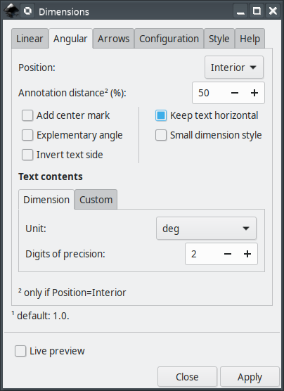
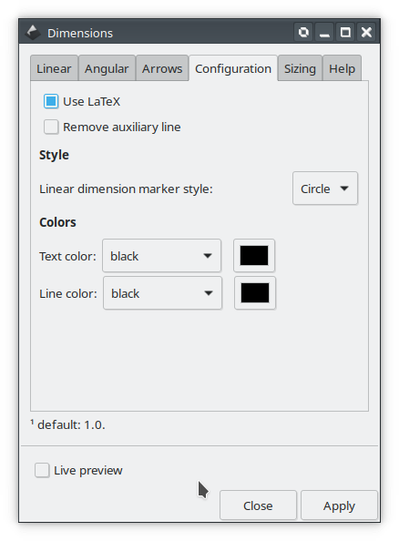

# dimensions
Inkscape extension to assist creating dimension annotations in [Inkscape](https://inkscape.org/).


### main features

The main features are

 - you can create linear and angular dimension annotation
 - you can choose custom text or actual dimension
 - you can select colors and annotation line sizes

## Current and older versions

Compatibility table

|  Inkscape        |  dimensions | inkscapeMadeEasy | Receive updates?|
|------------------|-----------------|------------------|-----------------|
|       1.0        | 1.0 (latest)    |   1.0 (latest)   | YES             |
| 0.48, 0.91, 0.92 | 0.9x (obsolete) |  0.9x (obsolete) | NO              |


**Latest version:** The latest version of **dimensions** is **1.0**. This version is compatible with Inkscape 1.0 and up only. It is **incompatible** with older Inkscape versions!

**Older versions:** If you have an older version of Inkscape, please use the files under the folder **0.9x** on Github.

**Important: Only the latest version will receive updates, new features, and bug fixes! The usage section in this documentation describes the latest version. In older versions, the disposition of the elements in the plugin's screen might be different. Some features might not be present or have different behavior.**

# Installation and requirements

Installation procedures for latest and older versions are described below.

## Requirements (all versions)

- You will need [inkscapeMadeEasy](https://github.com/fsmMLK/inkscapeMadeEasy) plugin installed. Check the compatibility table above to know the version you need.

## Installation procedure (v1.0 only)

**dimensions** was developed using Inkscape 1.0 in Linux (Kubuntu 18.04). It should work in different OSs too as long as all requirements are met.

1. Install [inkscapeMadeEasy](https://github.com/fsmMLK/inkscapeMadeEasy), **version 1.0** (latest). Follow the instructions in the manual page. **Note:** LaTeX text is used in **dimensions** if the support is activated (nicer results), otherwise regular text elements will be used.

2. **dimensions** installation

    1. Go to Inkscape's extension directory with a file browser. Your inkscape extension directory can be accessed by opening Inkscape and selecting ``Edit > Preferences > System``. Look for the item **User Extensions**  field. There is a button on the right of the field  that will open a file explorer window in that specific folder.

    2. Create a subfolder in the extension directory with the name ``dimensions``. **Important:**  Be careful with upper and lower case letters. You must write as presented above.

    3. Download **dimensions** files and place them inside the directory you just created.

       You don't have to copy all files from Github. The files you will need are inside the ``latest`` folder. In the end you must have the following files and directories in your Inkscape extension directory.

       **LaTeX users:** You can add macros to ``inkscapeMadeEasy/basicLatexPackages.tex``. In this case the same macros will be accessible by all plugins that employ inkscapeMadeEasy.

        ```
        inkscape
         ┣━━extensions
         ┋   ┣━━ inkscapeMadeEasy      <-- inkscapeMadeEasy folder
             ┃    ┣━━ inkscapeMadeEasy_Base.py
             ┃    ┣━━ inkscapeMadeEasy_Draw.py
             ┃    ┣━━ inkscapeMadeEasy_Plot.py
             ┃    ┗━━ basicLatexPackages.tex
             ┃
             ┣━━ textext               <-- texText folder (if you installed textText)
             ┃    ┋
             ┃
             ┣━━ dimensions            <-- dimensions folder
             ┋    ┣━━ dimensions.inx
                  ┗━━ dimensions.py
        
        NOTE: You might have other sub folders inside the extensions directory. They don't interfere with the plugin.
        ```

## Installation procedure (v0.9x only)

**dimensions** was developed using Inkscape 0.48 and 0.91 in Linux (Kubuntu 18.04). It should work in different OSs too as long as all requirements are met.

1. Install [inkscapeMadeEasy](https://github.com/fsmMLK/inkscapeMadeEasy), **version 1.0** (latest). Follow the instructions in the manual page. **Note:** LaTeX text is used in **dimensions** if the support is activated (nicer results), otherwise regular text elements will be used.

2. **dimensions** installation

    1. Go to Inkscape's extension directory with a file browser.

    2. Download **dimensions** files and place them inside the directory you just created.

       You don't have to copy all files from Github. The files you will need are inside the ``0.9x`` folder. In the end you must have the following files and directories in your Inkscape extension directory.

        ```
        inkscape
         ┣━━ extensions
         ┋    ┣━━ inkscapeMadeEasy_Base.py
              ┣━━ inkscapeMadeEasy_Draw.py
              ┣━━ inkscapeMadeEasy_Plot.py
              ┃
              ┣━━ textextLib
              ┃    ┣━━ __init__.py
              ┃    ┣━━ basicLatexPackages.tex
              ┃    ┣━━ textext.inx
              ┃    ┗━━ textext.py
              ┃
              ┣━━ dimensions.inx        <--   from repository folder 0.9x!
              ┗━━ dimensions.py         <--
        ```

# Usage

The extension can be found under `extensions > fsmMLK` menu.

This extension is presented in five tabs, **Linear**, **Angular**, **Arrows**, **Configuration** and  **Style**. The extension has three modes of operation. Depending on which tab is on top (Linear, Angular or Annotation arrow), the extension will create different elements in your document as soon as you click on `Apply` button (or check `live preview`). The usage in each mode is presented below.

  1- If `Linear` tab is on top, then the extension is set to draw linear dimension annotations

   In order to create linear annotations, you must create an auxiliary line, select this line and apply the extension as presented in the figure below. **Attention: the line segment must be composed by 2 vertices only**. You can select multiple lines, but the same parameters will be applied to all.


    
  2- If `Angular` tab is on top, then the extension is set to draw angular dimension annotations

   In order to create angular annotations, you must create an auxiliary line, select this line and apply the extension as presented in the figure below. **Attention: the line segment must be composed by 3 or 4 vertices only**. You can select multiple lines, but the same parameters will be applied to all.
    
   - If you select a line with 3 vertices, the angle will be defined such that the second vertex is the center.
   - If you select a line with 4 vertices, the angle will be defined by the segments 1-2 and 3-4.
    


  3- If `Arrows` tab is on top, then the extension is set to draw annotation arrows

   In order to create arrow annotations, you must create an auxiliary line, select this line and apply the extension as presented in the figure below. **Attention: the line segment must be composed by 3 vertices only**. You can select multiple lines, but the same parameters will be applied to all.
    
   - The first vertex will be the tip of the arrow
   - The second vertex determines the text anchor position
   - The third vertex defines the end of the horizontal line
    


## Linear tab


**Direction:** You can select the direction of linear dimension annotation


**Invert side:** Place the annotation in the other side of the selected segment


**Invert text side:** Place the text in the opposite side of the dimension line


**Keep text horizontal:** Forces the text to stay horizontal (does not affect horizontal dimension annotations)


**Small dimension style:** Annotation style for small linear distances


### Text contents section

In this section you can select the text contents of the linear dimension annotation. This section contais two subtabs, *Dimension* and *Custom*. The 'Apply' button will execute the action associated to the subtab that is on the top.


### Dimension  subtab

With this subtab on top, the extension will add text information about the size.

**Unit:** Here you can select the unit to be used. The value ``doc`` will use current document's unit.


**Scale factor:** Scaling factor of the dimention. The resulting text will be the size of the annotation multiplied by this factor.


**Digits of precision:**  You can adjust the number of decimals to be used


**Add unit symbol:** This option adds the selected unit symbol to the text

### Custom  subtab

With this subtab on top, you can enter any custom text.

**Custom contents:** Custom text of the annotation. If LaTeX support is enabled you can also use the mathematical environment $...$


## Angular tab



**Position:** You can select the position of the angular annotation.


**Annotation distance (%):** Sets the distance where the angle annotation is drawn, in percentage. This option is used only if `Position > Interior`


**Add center mark:** Marks the center of the angle with a cross.


**Explementary angle:** annotates the explementary angle, that is, the angle that completes 360 degrees. If this option is not selected, the selected angle will always be the smallest.


**Invert text side:** Place the text in the opposite side of the dimension line


**Keep text horizontal:** Forces the text to stay horizontal


**Small dimension style:** Annotation style for small angles


### Text contents section

In this section you can select the text contents of the angular dimension annotation. This section contains two subtabs, *Dimension* and *Custom*. The 'Apply' button will execute the action associated to the subtab that is on the top. See Linear tab section for examples.

### Dimension  subtab

With this subtab on top, the extension will add text information about the size.

**Unit:** This option adjust angular unit. The option rad(multiple of pi) will write the angle as a fraction of pi (see image below)


**Digits of precision:**  You can adjust the number of decimals to be used. See Linear tab section for examples.

### Custom  subtab

With this subtab on top, you can enter any custom text.

**Custom contents:** Custom text of the annotation. If LaTeX support is enabled you can also use the mathematical environment $...$


## Arrows tab

In this tab you can create annotation arrows with text. See images below.


**Scale factor:** Scaling factor exclusive for this type of annotation. This option will make the annotation bigger of smaller, but will not change any numerical value. This parameter does not affect the other dimension annotations.


**Contents:** Text of the annotation. If LaTeX support is enabled you can also use the mathematical environment $...$


## Configuration tab



**Use LaTeX:** (de)activates LaTeX support.

**Remove auxiliary line:** If selected, the auxiliary line used to create the annotations is deleted.


### Syle section

**Linear dimension marker style:** Selects the style of the marker for linear dimensions. This options does not
 affect angular and arrow annotations.
 


### Color section

This section controls the color of the auxiliary lines and text off all annotations.

In both cases, you have three options in the `Color` drop down menu:

  - You can select the predefined colors. They are presented below


  - You can select **none** to set no color (transparent)
  
  - You can select **use color picker** to choose the color from the color picker widget just to the right of the drop down menu. **Attention:** the color selected in the color picker widget will be considered **ONLY** if you select **use color picker** in the drop down menu. 


## Sizing tab

Here you can adjust the proportions of the annotations.


**Font size:** Adjusts the font size (h). Please keep in mind that all the proportions of the annotations refer to the font size. See image below.

**Default proportions:** If selected, the proportions between the elements of the dimension annotations follows the default proportions. See figure below. If selected, the other parameters below it will be ignored.


**Line width proportion, marker size proportion, Aux. line offset proportion, Aux. line extension proportion, Text
 offset proportion, Dimension distance proportion:** Change the proportions of the annotation. They affect the outcome only if `Default proportions` is NOT selected.

  - If this value is 1.0, then the size of the element follows the proportions presented in the figure above. Ex: `w=0.1*h`
  - If this value is different than 1.0, the size will be modified by multiplying if by this factor. Example: If `Line width proportion=1.5`, then `w=1.5*(0.1*h)`

