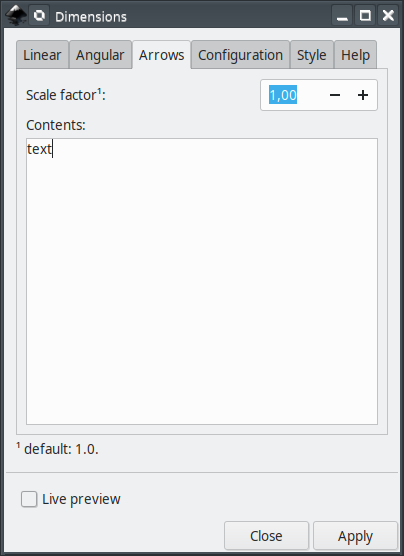

# dimensions
Inkscape extension to assist creating dimension annotations.


### main features

The main features are

 - you can create linear and angular dimension annotation
 - you can choose custom text or actual dimension
 - you can select colors and annotation line sizes

# Installation and requirements

This extension was partially developed in Inkscape 0.91 in Linux (Kubuntu 18.04). It should work on other versions of Inkscape. Also, it should work in different OSs too as long as all requirements are installed.

This extension requires another extension to run, inkscapeMadeEasy <https://github.com/fsmMLK/inkscapeMadeEasy>, which contains several backstage methods and classes.

In order to use inskacapeDimensions extension, you must also download inkscapeMadeEasy files and put them inside Inkscape's extension directory. Please refer to inkscapeMadeEasy installation instructions. In the end you must have the following files and directories in your Inkscape extension directory.

```
inkscape/extensions/
            |-- inkscapeMadeEasy_Base.py
            |-- inkscapeMadeEasy_Draw.py
            |-- inkscapeMadeEasy_Plot.py
            |-- textextLib
            |   |-- __init__.py
            |   |-- basicLatexPackages.tex
            |   |-- CircuitSymbolsLatexPreamble.tex      <-- add this file to  textextLib  subdirectoy
            |   |-- textext.inx
            |   |-- textext.py
            |
            |-- dimensions.py
            `-- cimensions.inx
```

**LaTeX package requirement**

If LaTeX support is enables (see below), you will need in your system the following packages: amsmath, amsthm, amsbsy, amsfonts, amssymb, siunitx, steinmetz


**Disabling LaTeX support of inkscapeMadeEasy**

Many of the methods implemented in inkscapeMadeEasy project use LaTeX to generate text. To this end I decided to employ the excellent extension **textext** from Pauli Virtanen  <https://pav.iki.fi/software/textext/>. 

LaTeX support via textext extension requires LaTeX typesetting system in your computer (it's free and awesome! =] ), together with a few python modules (pygtk and Tkinter among others). The later might be a problem for non-Linux systems (precompiled inkscape for Windows as OS X don't come with them).

Since many people don't use LaTeX and/or don't have it installed, inkscapeMadeEasy's LaTeX support is now optional. **By default, LaTeX support is ENABLED.**

Please refer to <https://fsmmlk.github.io/inkscapeMadeEasy/#installation-and-requirements> on how to easily disable LaTeX support.

.. warning:: Since disabling LaTeX support is a new feature, this project was not yet extensively checked for misplacements/errors when this support is disabled. Please report any issues you find.

# Usage

This extension is presented in five tabs, **Linear**, **Angular**, **Arrows**, **Configuration** and  **Colors**. The extension has three modes of operation. Depending on which tab is on top (Linear, Angular or Annotation), the extension will create different elements in your document as soon as you click on `Apply` button (or check `live preview`). The usage in each mode is presented below.

  1- If `Linear` tab is on top, then the extension is set to draw linear dimension annotations

   In order to create linear annotations, you must create an auxiliary line, select this line and apply the extension as presented in the figure below. **Attention: the line segment must be composed by 2 vertices only**. You can select multiple lines, but the same parameters will be applied to all.

    

  2- If `Angular` tab is on top, then the extension is set to draw angular dimension annotations

   In order to create angular annotations, you must create an auxiliary line, select this line and apply the extension as presented in the figure below. **Attention: the line segment must be composed by 3 or 4 vertices only**. You can select multiple lines, but the same parameters will be applied to all.
    
   - If you select a line with 3 vertices, the angle will be defined such that the second vertex is the center.
   - If you select a line with 4 vertices, the angle will be defined by the segments 1-2 and 3-4.
    
    

  3- If `Arrows` tab is on top, then the extension is set to draw annotation arrows

   In order to create arrow annotations, you must create an auxiliary line, select this line and apply the extension as presented in the figure below. **Attention: the line segment must be composed by 3 vertices only**. You can select multiple lines, but the same parameters will be applied to all.
    
   - The first vertex will be the tip of the arrow
   - The second vertex determines the text anchor position
   - The third vertex defines the end of the horizontal line
    
    

### Linear


**Direction:** You can select the direction of linear dimension annotation (see below)


**Invert side:** Place the annotation in the other side of the selected segment


**Invert text side:** Place the text in the opposite side of the dimension line


**Keep text horizontal:** Forces the text to stay horizontal (does not affect horizontal dimension annotations)


**Small dimension style:** Annotation style for small linear distances


**Type:** Sets the type of text contents. If you select ``Custom``, you can type the text in the field **Custom contents**. (see below)


**Unit:** If you select `Type > Dimension`, this option adds unit to the dimension value. This option will just add the unit and will NOT scale the value.


**Dimension scale factor:** If you select `Type > Dimension`, this option will scale (multiply) the dimension value by the provided number here.


**Digits of precision:**  If you select `Type > Dimension`, you can adjust the number of decimals to be used


**Custom contents:** Custom text of the annotation. Used only if `Type > Custom`. If LaTeX support is enabled you can also use the mathematical environment $...$

### Angular


**Position:** You can select the position of the angular annotation (see below).


**Annotation distance in %:** Sets the distance where the angle annotation is drawn, in percentage. This option is used only if `Position > Interior`


**Add center mark:** Marks the center of the angle with a cross.


**Explementary angle:** annotates the explementary angle, that is, the angle that completes 360 degrees. If this option is not selected, the selected angle will always be the smallest.


**Invert text side:** Place the text in the opposite side of the dimension line


**Keep text horizontal:** Forces the text to stay horizontal


**Small dimension style:** Annotation style for small angles


**Type:** Sets the type of text contents. If you select ``Custom``, you can type the text in the field **Custom contents**. See Linear tab section for examples.

**Unit:** If you select `Type > Dimension`, this option adds unit to the dimension value. This option will just add the unit and will NOT scale the value. The option rad(multiple of pi) will write the angle as a fraction of pi (see image below)


**Digits of precision:**  If you select `Type > Dimension`, you can adjust the number of decimals to be used. See Linear tab section for examples.

**Custom contents:** Custom text of the annotation. Used only if `Type > Custom`. If LaTeX support is enabled you can also use the mathematical environment $...$

### Arrows



**Scale factor:** Scaling factor. This parameter does not affect the other dimension annotations.


**Contents:** Text of the annotation. If LaTeX support is enabled you can also use the mathematical environment $...$


### Configuration


**Use LaTeX:** (de)activates LaTeX support.

**Remove auxiliary line:** If selected, the auxiliary line used to create the annotations is deleted

**Font size:** Adjusts the font size (h)

**Default proportions:** If selected, the proportions between the elements of the dimension annotations follows the default proportions. See figure below. If selected, the other parameters below it will be ignored.


**Line width proportion, Arrow size proportion, Aux. line offset proportion, Aux. line extension proportion, Text offset proportion, Dimension distance proportion:** Change the proportions of the annotation. They affect the outcome only if `Default proportions` is NOT selected.

  - If this value is 1.0, then the size of the element follows the proportions presented in the figure above. Ex: `w=0.1*h`
  - If this value is different than 1.0, the size will be modified by multiplying if by this factor. Example: If `Line width proportion=1.5`, then `w=1.5*(0.1*h)`

### Colors


This tab is divided in two sections. The first controls the color of the text, the second controls the color of the lines.

In both cases, you have two options in the `Color` drop down menu:

  - You can select a few predefined colors. (See figure below)

  - You can select **none** to set no color (transparent)

  - You can select **use color picker** to choose the color from the color picker widget just below the `Color` drop down menu. **Attention:** the color selected in the color picker widget will be considered **ONLY** if you select **use color picker** in the drop down menu. 


